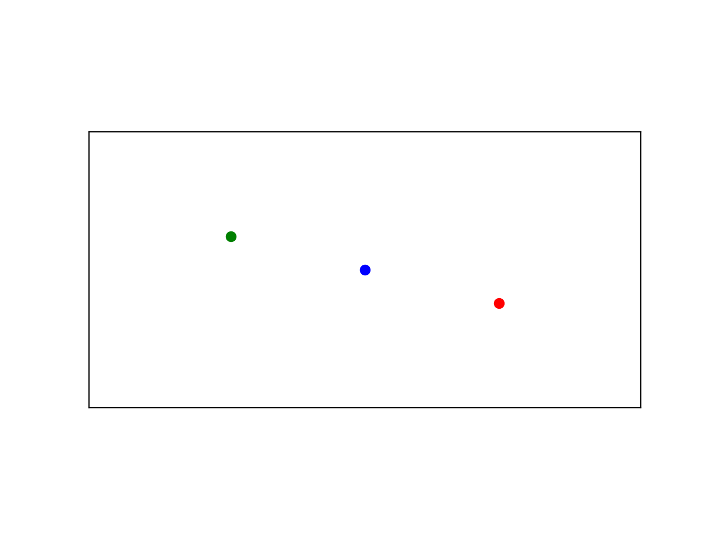
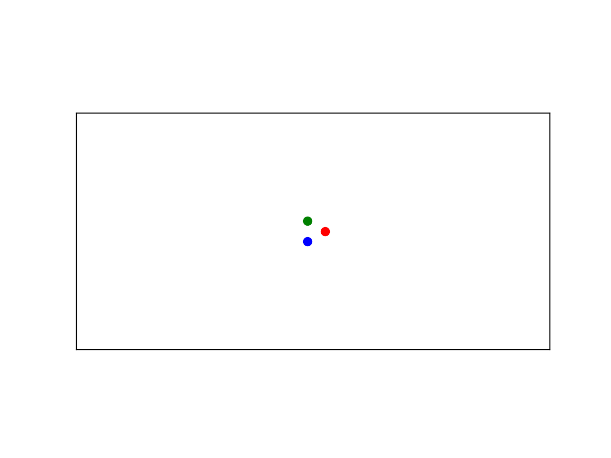

# 2D N-body Problem solver

This solver uses dimensionless gravitational interaction forces between `n` bodies and a Verlet integrator to simulate their orbits in 2D. Using an input file `initial-conditions.cvs` storing the initial conditions in position and velocity as well as the mass of each body, the program can be used as follows:

- Create a folder `build`:
  ```cpp
  $ mkdir build
  $ cd ./build
  ````
- Compile the project:
  ```cpp
  $ cmake ..
  $ make
- Run the executable `nbody` with the arguments (optional in `[]`):
  ```cpp
  $ .\nbody <initial_conditions_file> [T_start] [T_end] [dt]
  ````
## Examples

The classic *figure-eight* solution for a 3-body problem can be found using these initial conditions:
```csv
# x,y,vx,vy,mass
0.97000436,-0.24308753,0.4662036850,0.4323657300,1.0
-0.97000436,0.24308753,0.4662036850,0.4323657300,1.0
0.0,0.0,-0.93240737,-0.86473146,1.0
```


Trying to solve the *equilateral Lagrange triangle*, also for a 3 bodies, an initial triangle is observed and later the chaotic nature of the problem kicks off:
```csv
# x,y,vx,vy,mass
1.0,0.0,0.0,0.932,1.0
-0.5,0.8660254,-0.807, -0.466,1.0
-0.5,-0.8660254,0.807, -0.466,1.0
```
